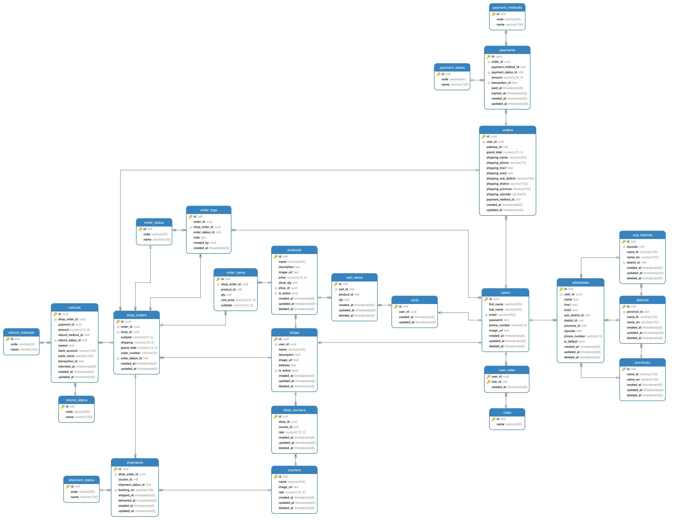
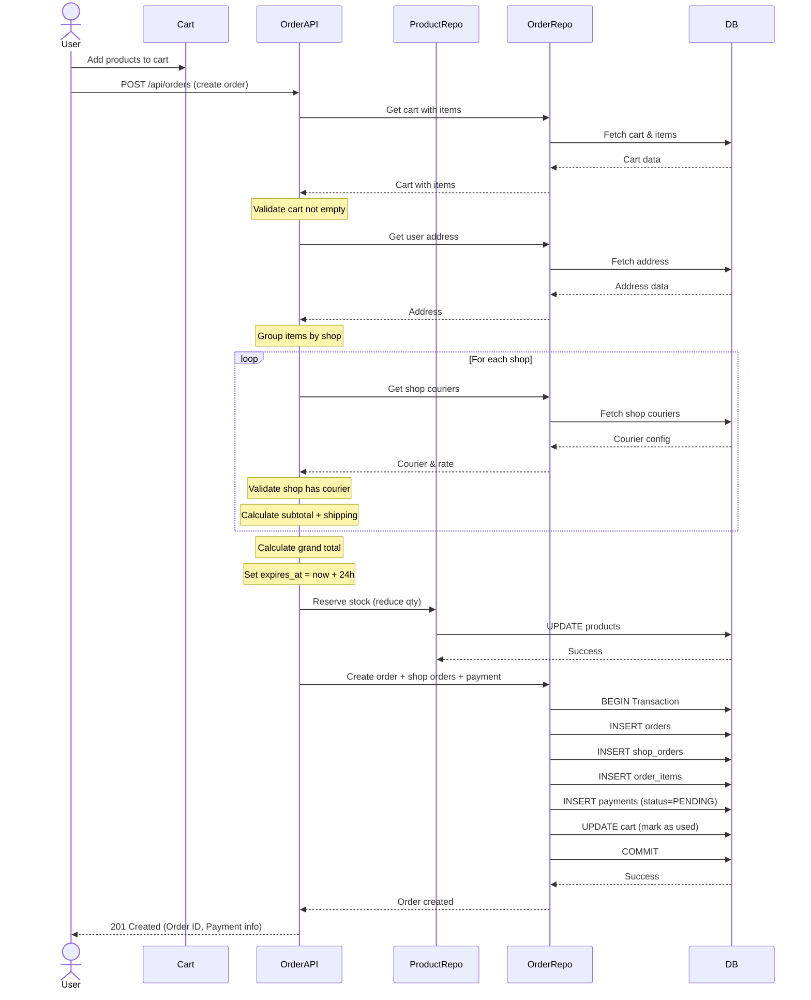
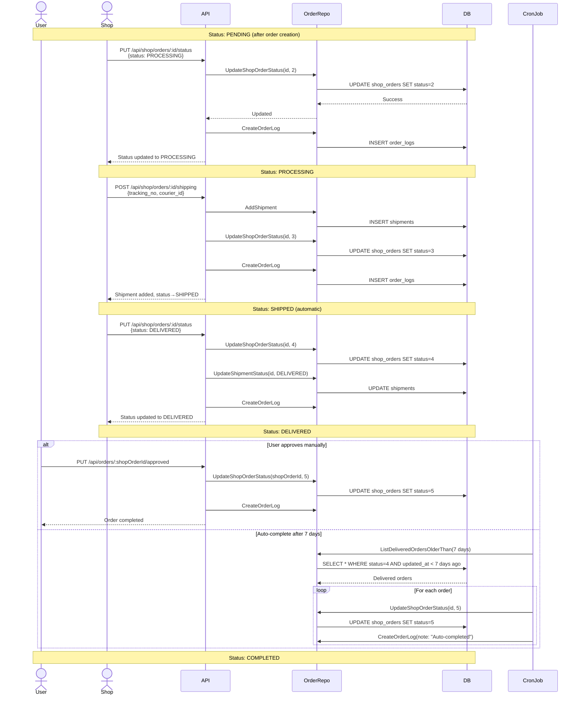
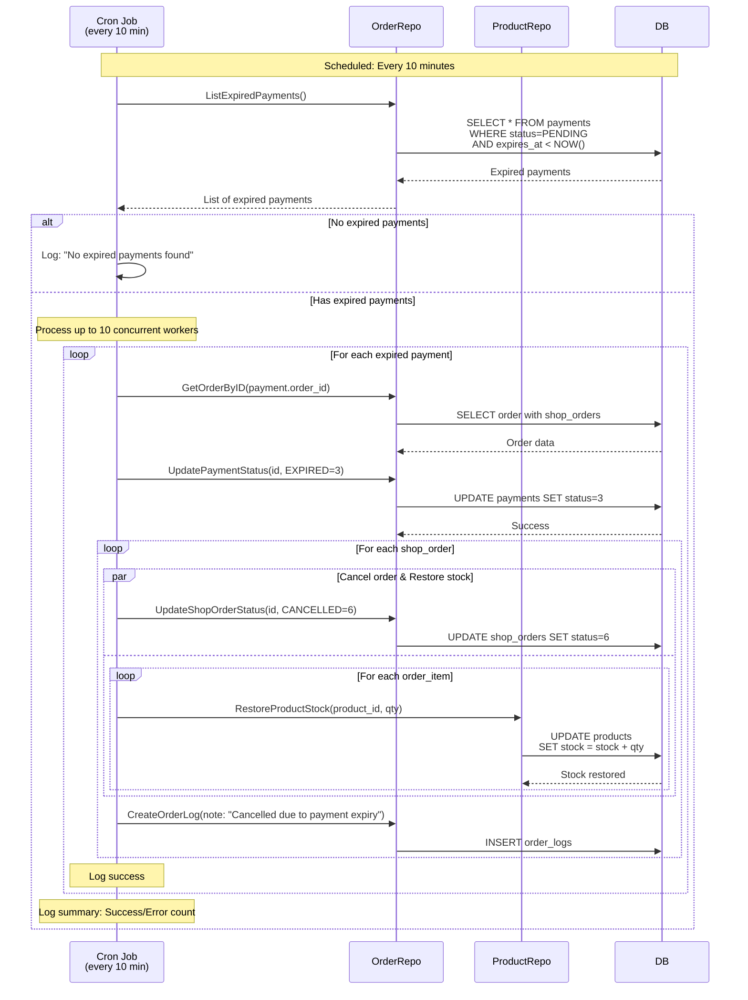
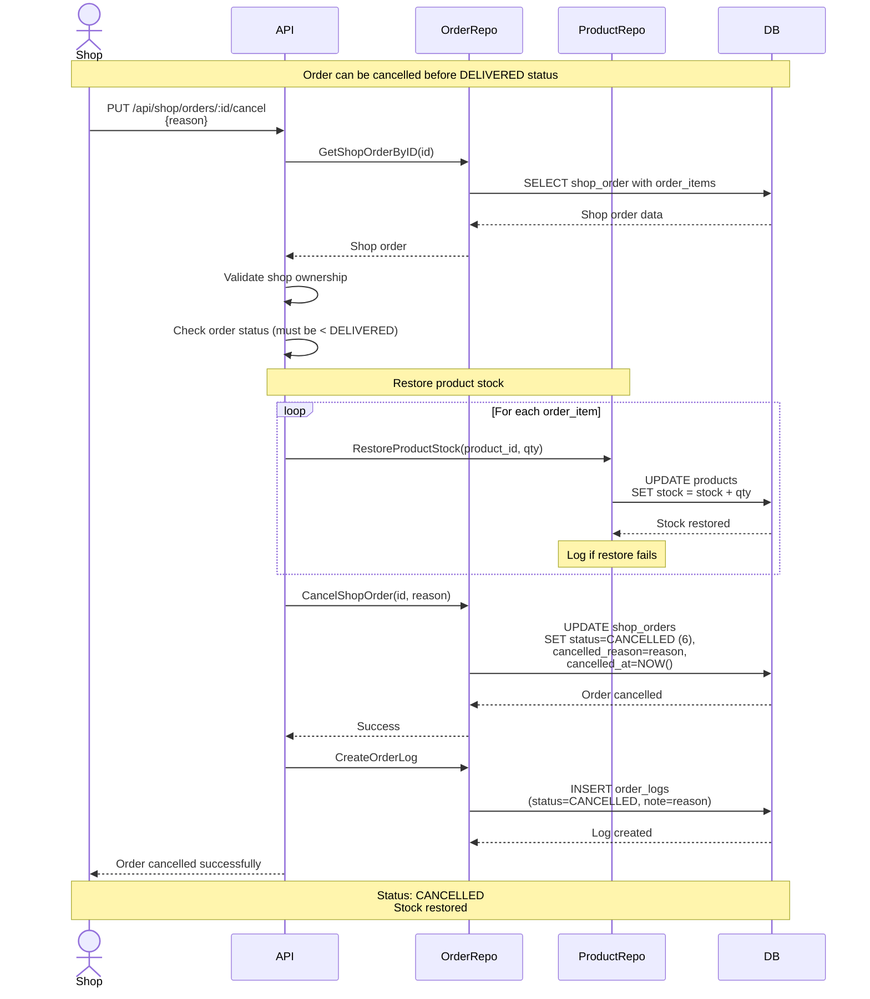
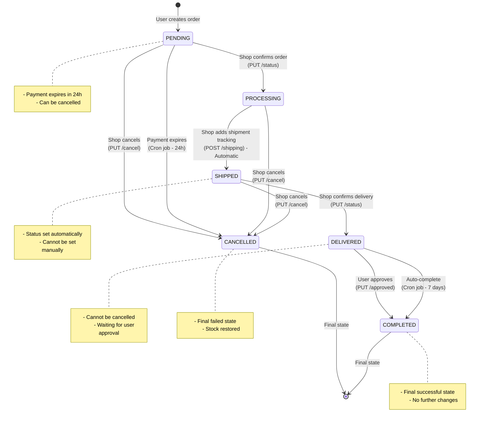
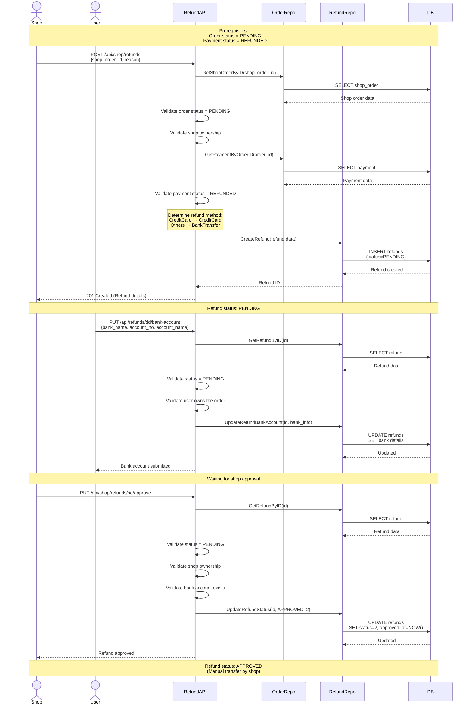

# E-commerce Go API

E-commerce API built with Go, Clean Architecture, and PostgreSQL.

## Requirement

- The system has 2 parties (shop, user),
- Shop can create products for customers (users),
- Users can view products in each shop,
- Users can buy products and know the courier that delivers products to the user,
- Shop can manage orders (Change order status, Cancel order, etc...)

## User Roles

| Role      | Description                                                                                  |
| --------- | -------------------------------------------------------------------------------------------- |
| **USER**  | Customer role - Browse products, manage cart, create orders, submit bank account for refunds |
| **SHOP**  | Seller role - Manage products, couriers, process orders, handle refunds                      |
| **ADMIN** | System administrator - (Reserved for future features)                                        |

> **Note:** Admin role exists in the database but is not yet implemented in current features.

## Tech Stack

- **Framework:** [Echo v4](https://echo.labstack.com/)
- **ORM:** [GORM v1.31](https://gorm.io/)
- **Database:** PostgreSQL with pgx driver
- **Authentication:** JWT (golang-jwt/jwt v5)
- **Validation:** go-playground/validator v10
- **Password Hashing:** bcrypt
- **Documentation:** Swaggo
- **Logging:** Logrus
- **Cron Jobs:** go-cron v2
- **Dev Tools:** Air (hot reload), gomock (testing)

## Project Structure

```text
ecommerce-go-api/
├── config/                 # Database & environment config
├── domain/                 # Business logic interfaces
├── entity/                 # Database models (GORM)
├── feature/                # Feature modules (Clean Architecture)
│   ├── auth/
│   ├── cart/
│   ├── courier/
│   ├── location/
│   ├── order/
│   ├── product/
│   ├── refund/
│   ├── shop/
│   └── user/
├── internal/               # Internal packages
│   ├── constant/
│   ├── cron/               # Scheduled tasks
│   ├── errmap/
│   ├── hash/
│   ├── jwt/
│   ├── response/
│   └── validator/
├── middleware/             # Auth, CORS, logging
├── migrations/             # Database migrations
├── scripts/migrate/        # Migration runner tool
├── docs/                   # Swagger docs
├── er/                     # ER Diagram
└── main.go
```

## Database Schema

### ER Diagram



<!-- **Tables:**

- **users, roles, user_roles** - Authentication & authorization
- **shops, products** - Product
- **carts, cart_items** - Shopping cart
- **orders, shop_orders, order_items, order_logs** - Order management
- **payments, payment_methods, payment_status** - Payment processing
- **shipments, couriers, shipment_status** - Shipping
- **refunds, refund_status** - Refund handling
- **provinces, districts, sub_districts** - Location data -->

## Quick Start

### Prerequisites

- Go 1.25+
- PostgreSQL 14+
- Docker (optional)

### Installation

```bash
# 1. Clone repository
git clone <repo-url>
cd ecommerce-go-api

# 2. Install dependencies
go mod download

# 3. Install development tools
make prepare

# 4. Setup environment
cp .env.example .env
# Edit .env with your configuration

# 5. Start PostgreSQL (using Docker)
make docker-up

# 6. Run migrations
make db-setup

# 7. Start server
make dev
```

Application runs at: `http://localhost:8080`

### Environment Variables

```env
# Server
PORT=8080
ECHO_MODE=release

# Database
POSTGRES_HOST=localhost
POSTGRES_PORT=5432
POSTGRES_USER=postgres
POSTGRES_PASSWORD=postgres
POSTGRES_DB=ecommerce_db

# JWT
JWT_SECRET=your-secret-key
JWT_EXPIRE_HOURS=24
```

## Development Commands

### General

```bash
make prepare          # Install dev tools (Air, Swag, Mockgen)
make run              # Run application
make dev              # Run with hot reload
make tidy             # Tidy go modules
```

### Database

```bash
make migrate-up       # Run migrations
make migrate-down     # Rollback last migration
make migrate-status   # Check migration status
make db-setup         # Setup database
make db-reset         # Reset database
```

**Note:** The migration includes `sub_districts` table with sample data only. The full dataset is too large to include in the migration script.

### Testing

```bash
make test             # Run tests (order feature)
make test-coverage    # Generate coverage report
```

### Docker

```bash
make docker-up        # Start PostgreSQL
make docker-down      # Stop services
make docker-logs      # View logs
```

### Documentation

```bash
make swagger          # Generate Swagger docs
```

### Code Generation

```bash
make mock             # Generate mocks for testing
```

## API Endpoints

### Authentication

| Method | Endpoint                  | Auth | Description               |
| ------ | ------------------------- | ---- | ------------------------- |
| POST   | `/api/auth/register`      | -    | Register new user account |
| POST   | `/api/auth/register-shop` | -    | Register new shop account |
| POST   | `/api/auth/login`         | -    | Login (returns JWT token) |
| POST   | `/api/auth/refresh`       | -    | Refresh JWT token         |

### User Profile & Addresses

| Method | Endpoint                            | Auth | Description         |
| ------ | ----------------------------------- | ---- | ------------------- |
| GET    | `/api/profile`                      | USER | Get user profile    |
| PATCH  | `/api/profile`                      | USER | Update user profile |
| GET    | `/api/profile/addresses`            | USER | List user addresses |
| POST   | `/api/profile/addresses`            | USER | Create new address  |
| GET    | `/api/profile/addresses/:addressId` | USER | Get address by ID   |
| PATCH  | `/api/profile/addresses/:addressId` | USER | Update address      |
| DELETE | `/api/profile/addresses/:addressId` | USER | Delete address      |

### Locations

| Method | Endpoint                                       | Auth | Description                    |
| ------ | ---------------------------------------------- | ---- | ------------------------------ |
| GET    | `/api/locations/provinces`                     | -    | List all provinces             |
| GET    | `/api/locations/districts?provinceId={id}`     | -    | List districts by province     |
| GET    | `/api/locations/sub-districts?districtId={id}` | -    | List sub-districts by district |

### Products

| Method | Endpoint                        | Auth | Description                |
| ------ | ------------------------------- | ---- | -------------------------- |
| GET    | `/api/products`                 | -    | List all products (public) |
| GET    | `/api/products/:productId`      | -    | Get product details        |
| GET    | `/api/shop/products`            | SHOP | List shop's own products   |
| POST   | `/api/shop/products`            | SHOP | Create new product         |
| GET    | `/api/shop/products/:productId` | SHOP | Get shop's product details |
| PUT    | `/api/shop/products/:productId` | SHOP | Update product             |
| DELETE | `/api/shop/products/:productId` | SHOP | Delete product             |

### Shops

| Method | Endpoint             | Auth | Description             |
| ------ | -------------------- | ---- | ----------------------- |
| GET    | `/api/shops`         | -    | List all shops (public) |
| GET    | `/api/shops/:shopId` | -    | Get shop details        |
| GET    | `/api/shop`          | SHOP | Get own shop details    |
| PUT    | `/api/shop`          | SHOP | Update shop details     |
| GET    | `/api/shop/couriers` | SHOP | Get shop's couriers     |
| PUT    | `/api/shop/couriers` | SHOP | Update shop's couriers  |

### Cart

| Method | Endpoint                  | Auth | Description               |
| ------ | ------------------------- | ---- | ------------------------- |
| GET    | `/api/cart`               | USER | Get user's cart           |
| POST   | `/api/cart`               | USER | Add item to cart          |
| POST   | `/api/cart/estimate`      | USER | Estimate cart total       |
| PUT    | `/api/cart/items/:itemId` | USER | Update cart item quantity |
| DELETE | `/api/cart/items/:itemId` | USER | Remove item from cart     |

### Orders (User)

| Method | Endpoint                            | Auth | Description              |
| ------ | ----------------------------------- | ---- | ------------------------ |
| POST   | `/api/orders`                       | USER | Create order from cart   |
| GET    | `/api/orders`                       | USER | List user's orders       |
| GET    | `/api/orders/:shopOrderId`          | USER | Get order details        |
| POST   | `/api/orders/:orderId/payment`      | USER | Create payment for order |
| GET    | `/api/orders/:shopOrderId/tracking` | USER | Get shipment tracking    |
| PUT    | `/api/orders/:shopOrderId/approved` | USER | Approve delivered order  |
| GET    | `/api/order-groups`                 | USER | List order groups        |
| GET    | `/api/order-groups/:orderId`        | USER | Get order group details  |

### Orders (Shop)

| Method | Endpoint                                 | Auth | Description                                          |
| ------ | ---------------------------------------- | ---- | ---------------------------------------------------- |
| GET    | `/api/shop/orders`                       | SHOP | List shop's orders                                   |
| GET    | `/api/shop/orders/:shopOrderId`          | SHOP | Get shop order details (includes shipment if exists) |
| GET    | `/api/shop/orders/:shopOrderId/tracking` | SHOP | Get shipment tracking                                |
| PUT    | `/api/shop/orders/:shopOrderId/status`   | SHOP | Update order status                                  |
| PUT    | `/api/shop/orders/:shopOrderId/cancel`   | SHOP | Cancel order                                         |
| POST   | `/api/shop/orders/:shopOrderId/shipping` | SHOP | Add shipment tracking                                |

### Couriers

| Method | Endpoint        | Auth | Description             |
| ------ | --------------- | ---- | ----------------------- |
| GET    | `/api/couriers` | SHOP | List available couriers |

### Refunds

| Method | Endpoint                              | Auth | Description                    |
| ------ | ------------------------------------- | ---- | ------------------------------ |
| POST   | `/api/shop/refunds`                   | SHOP | Create refund for order        |
| PUT    | `/api/shop/refunds/:refundId/approve` | SHOP | Approve refund                 |
| PUT    | `/api/refunds/:refundId/bank-account` | USER | Submit bank account for refund |

## Prerequisites & Flow

### User Prerequisites

Before a user can create an order:

1. User account must be created
2. **At least one delivery address must be added** (via `/api/profile/addresses`)
3. Products must be added to cart
4. Selected products must be from shops with configured couriers

### Shop Prerequisites

Before a shop can receive orders:

1. Shop account must be created
2. Shop must have at least one product
3. Shop must configure (via `/api/shop/couriers`)
4. Products must have sufficient stock

### Complete User Journey

```text
1. Register → Add Address → Browse Products
                          ↓
2. Add to Cart → Review Cart → Create Order
                          ↓
3. Select Payment → Complete Payment → Wait for Shop Confirmation
                          ↓
4. Shop Processes → Shop Ships → Delivered → Approve Order
                          ↓
5. (Optional) Shop Creates Refund → User Submits Bank Account → Shop Approves
```

### Complete Shop Journey

```text
1. Register → Setup Courier Options → Add Products
                          ↓
2. Receive Orders → Confirm/Cancel Order → Process Order
                          ↓
3. Ship Order → Add Shipment Tracking → Monitor Delivery Status
                          ↓
4. Order Delivered → (If needed) Create Refund → Wait for User Bank Account → Approve Refund
```

### Shipment Tracking

**Both USER and SHOP can view shipment tracking information:**

- **User:** `GET /api/orders/:shopOrderId/tracking` - Dedicated tracking endpoint
- **Shop:**
  - `GET /api/shop/orders/:shopOrderId/tracking` - Dedicated tracking endpoint
  - `GET /api/shop/orders/:shopOrderId` - Shipment info included in order details response

**Shipment Information includes:**

- Tracking number
- Courier details
- Shipment status
- Shipped date
- Creation/update timestamps

## API Documentation (Swagger)

Complete interactive API documentation with request/response examples:

```text
http://localhost:8080/swagger/index.html
```

All endpoints are documented with Swagger annotations including authentication requirements, request bodies, and response schemas.

## Testing

> **Note:** Unit tests are implemented for the **Order** feature only.

### Run Tests

```bash
# Run order tests
make test

# With coverage report
make test-coverage
```

### Test Coverage

Current: **Order feature** (~25% usecase coverage)

**Test scenarios:**

- Create order success
- Cart validation errors
- Address validation
- Shipping options validation
- Database error handling

## Business Logic

### Cart & Shipping Estimation

**Endpoint:** `POST /api/cart/estimate`

**How it works:**

1. Groups selected cart items by shop
2. Calculates subtotal for each shop
3. Uses the shop's configured courier and rate
4. Calculates grand total = sum of (shop subtotal + shipping cost)

**Important Notes:**

- Each shop can configure **exactly one courier** with a custom rate
- Users cannot select courier (automatically uses shop's configured courier)
- If a shop has no configured courier, estimation and order creation will fail
- Shipping cost is determined by the shop's courier rate, not by product weight/distance

### Order Flow

1. User adds products to cart
2. User estimates shipping cost (optional via `/api/cart/estimate`)
3. User creates order → **PENDING**
   - System groups items by shop
   - Creates shop orders
   - Snapshots prices
   - Uses shop's configured courier
   - Creates payment record
4. Shop confirms order (via `PUT /api/shop/orders/:shopOrderId/status`) → **PROCESSING**
5. Shop adds shipment tracking (via `POST /api/shop/orders/:shopOrderId/shipping`) → **SHIPPED** (automatic)
6. Shop updates to delivered (via `PUT /api/shop/orders/:shopOrderId/status`) → **DELIVERED**
7. User approves order (manual) OR auto-complete after 7 days (cron job) → **COMPLETED**

**Notes:**

- Shop can cancel order before DELIVERED status (via `PUT /api/shop/orders/:shopOrderId/cancel`)
- SHIPPED status is set automatically when shop adds shipment tracking, not manually updated
- Shop can only manually update to: PROCESSING, DELIVERED, COMPLETED (not SHIPPED)

### Sequence Diagrams

#### 1. Order Creation Flow



#### 2. Order Lifecycle (Shop Processing)



#### 3. Payment Expiry & Auto-Cancel



#### 4. Order Cancellation Flow



#### 5. Order Status State Machine



#### 6. Refund Flow



### Payment Methods

- **Credit Card** - Instant
- **COD** - Cash on delivery
- **Bank Transfer**
- **PromptPay**

### Refund Rules

**Prerequisites:**

- Order status must be PENDING (status = 1)
- Payment status must be REFUNDED (status = 6)

**Flow:**

1. Shop creates refund request for eligible order
2. User submits bank account details for refund transfer
3. Shop approves or rejects the refund

> **Note:** Current implementation allows refunds only for PENDING orders with REFUNDED payment status.

## Background Jobs

Automated cron tasks:

**Payment Expiry Check** (every 10 min)

- Mark expired payments
- Cancel orders
- Restore stock

**Auto-Complete Orders** (daily 00:00)

- Complete DELIVERED orders after 7 days

## License

MIT License

## Author

Kiattisak Chantharamaneechote - kiattisak.c@pdkm.tech
